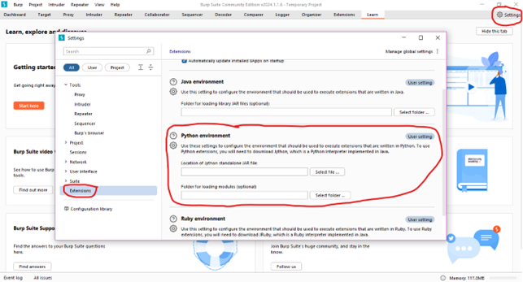
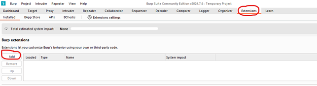
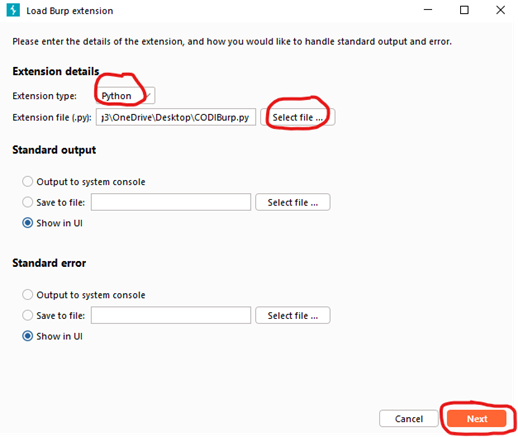
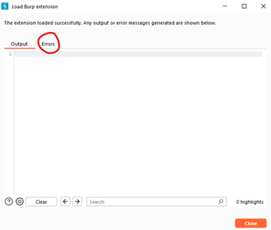
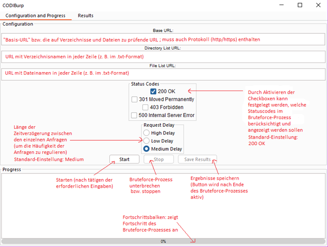
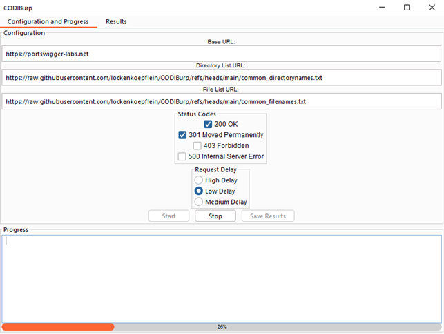
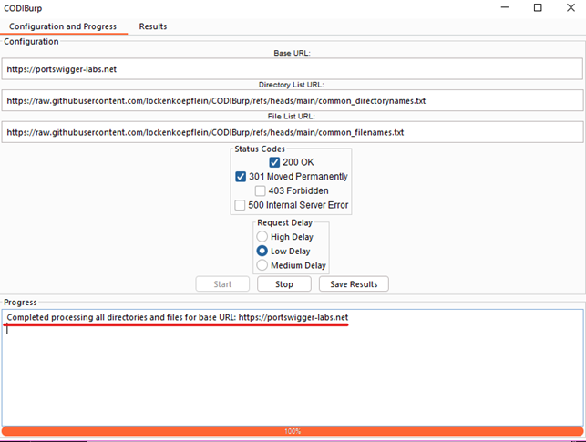
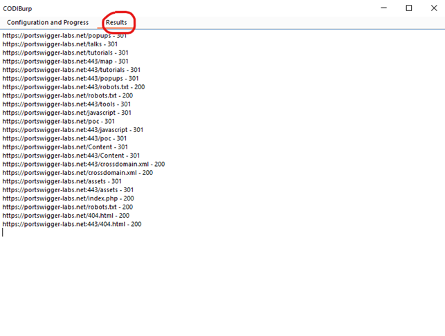
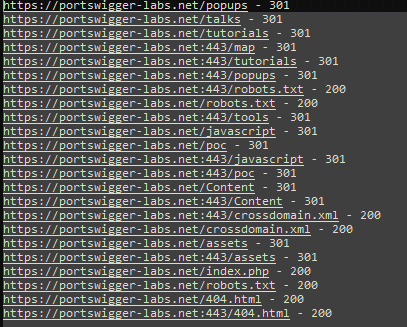

# Burp Suite Extension "CODIBurp"

## Description
A content discovery extension for Burp Suite – automating the discovery of hidden directories and files on web servers to identify potential security vulnerabilities.

## Installation/Setup

1. **Install Burp Suite Community Edition:**  
   [Download Burp Suite Community Edition - PortSwigger](https://portswigger.net/burp/communitydownload)

2. **Download Jython standalone jar file:**  
   [Downloads | Jython](https://www.jython.org/download)  
   (under Jython Standalone); it is the file in the format "jython-standalone-X.X.X.jar."

3. **Start Burp Suite:**  
     
   

4. **Configure settings in Burp Suite under Extensions:**  
     
   Here, enter the Jython Standalone JAR file and, if necessary, the path for the extension in the respective fields.

5. **Download the CODIBurp.py file from the GitHub repository:**  
   [CODIBurp/CODIBurp.py at main · lockenkoepflein/CODIBurp · GitHub](https://github.com/lockenkoepflein/CODIBurp/blob/main/CODIBurp.py)  
   Save the file in the directory specified in the "Folder for loading modules" field.

6. **In Burp Suite, click the "Add" button under "Extensions":**  
   

   - **Extension type:** Select Python.
   - **For Extension file**, choose the downloaded .py file.
   - Then, click the "Next" button.  
   

   The extension will now be loaded into Burp Suite, and the tool's GUI should appear.  
   If there are issues with loading, they will be displayed under "Errors":  
   

## Usage

**GUI with a short description:**  

After configuring and starting the brute force process with the "Start" button, the current progress can be seen on the progress bar:  

The following lists (but also others) can be used for the brute force process:
- [common_directorynames.txt](https://raw.githubusercontent.com/lockenkoepflein/CODIBurp/refs/heads/main/common_directorynames.txt)
- [common_filenames.txt](https://raw.githubusercontent.com/lockenkoepflein/CODIBurp/refs/heads/main/common_filenames.txt)

Note that the URLs should point to a list where each new line contains a file or directory name.

Once the brute force process is completed based on the configured lists, the "Save Results" button becomes active, and the following message appears under "Progress":  

Switching to the "Results" tab will list the found files and directories (only results with the desired status codes will be displayed):  

Clicking the "Save Results" button will create a .txt file in the directory where the .py file is located. This file will contain the found directories and files:  

## License
The project is available under the MIT license. See the [LICENSE](https://github.com/lockenkoepflein/CODIBurp/LICENSE) file.